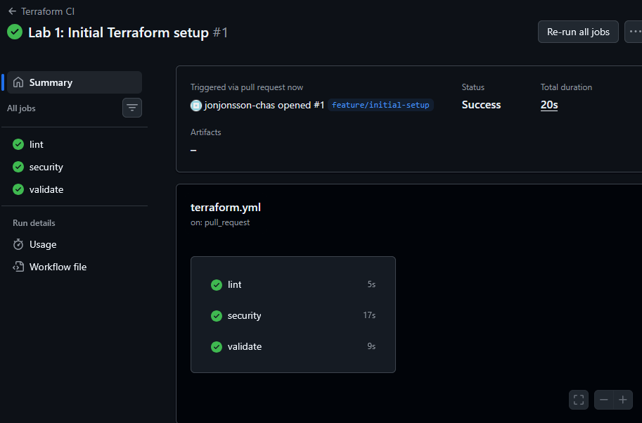
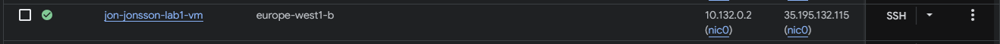

# Lab 1 – Terraform + GCP VM

## Vad projektet gör

Det här projektet provisionerar en virtuell Linux-maskin på Google Cloud Platform med hjälp av Terraform. Infrastrukturen definieras som kod: en `e2-micro`-instans skapas i ett angivet GCP-projekt med ett startup-skript som härdas automatiskt vid boot. En GitHub Actions CI/CD-pipeline kör `terraform fmt`, `validate` och `plan` vid varje push eller pull request, vilket säkerställer att konfigurationen alltid är korrekt formaterad och syntaktiskt giltig innan den når `main`.

---

## Kom igång

### Förutsättningar

- [Terraform](https://developer.hashicorp.com/terraform/install) ≥ 1.x
- [Google Cloud SDK](https://cloud.google.com/sdk/docs/install) autentiserat (`gcloud auth application-default login`)
- Ett GCP-projekt med Compute Engine API aktiverat

### Klona repot
```bash
git clone https://github.com/jonjonsson-chas/lab1-terraform.git
cd lab1-terraform
```

### Kör Terraform
```bash
# 1. Initiera providers och backend
terraform init

# 2. Granska vad som kommer skapas
terraform plan

# 3. Skapa resursen
terraform apply
```

> För att ta bort resursen: `terraform destroy`

---

## CI/CD-pipeline

GitHub Actions kör automatiskt `fmt`, `validate` och `plan` vid push till alla brancher samt vid pull requests mot `main`.

**Screenshot – pipeline som passerar:**



---

## VM i GCP Console

**Screenshot – VM-instansen i GCP Compute Engine:**



---

## Säkerhetsbeslut

| Åtgärd | Motivering |
|---|---|
| **ufw (Uncomplicated Firewall)** | Begränsar inkommande trafik till enbart port 22 (SSH) och 80/443 (HTTP/HTTPS). Minskar attackytan drastiskt genom att blockera alla övriga portar som standard. |
| **fail2ban** | Övervakar SSH-inloggningsförsök och bannar automatiskt IP-adresser efter upprepade misslyckade försök. Skyddar mot brute-force-attacker. |
| **Automatisk säkerhetsuppdatering** | `unattended-upgrades` håller OS-paket patchade utan manuell intervention, vilket minskar risken för kända sårbarheter. |
| **Inget root-login via SSH** | SSH-konfigurationen tillåter inte direktinloggning som root. Alla kommandon med förhöjda rättigheter kräver `sudo`. |
| **GCP Firewall Rules** | Nätverkstrafik filtreras även på GCP-nivå (utöver ufw) enligt principen om defense-in-depth – två lager av brandvägg. |

---

## Projektstruktur
```
lab1-terraform/
├── .github/
│   └── workflows/
│       └── terraform.yml   # CI/CD-pipeline
├── main.tf                 # Huvud-infrastruktur (VM, nätverk)
├── variables.tf            # Inmatningsvariabler
├── outputs.tf              # Outputs (t.ex. extern IP)
├── startup.sh              # Härdningsskript som körs vid boot
└── .terraform.lock.hcl     # Låst provider-version
```# sprint1
lab 1: terraform + gcp vm
